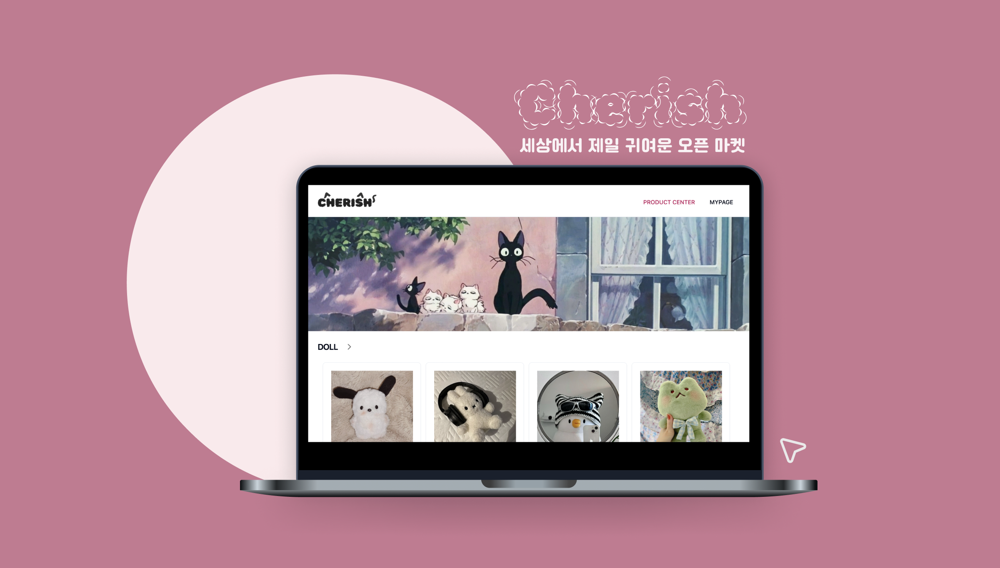

---
layout:
  title:
    visible: true
  description:
    visible: false
  tableOfContents:
    visible: true
  outline:
    visible: true
  pagination:
    visible: true
---

# Cherish 🐈‍⬛

<figure><figcaption></figcaption></figure>

### ☁️ 서비스 바로가기

[cherishhh.shop](https://cherishhh.shop/)

#### 📍 테스트 계정 - 판매 회원

```
ID: test0@test.com
PW: test000!
```

#### 📍 테스트 계정 - 일반 회원

```
ID: test1@gmail.com
PW: test111!
```

### 📚 개발 일지

Notion

### ✏️ 프로젝트 개요

* 이것저것 섞여있는 중고 마켓은 피곤할 때! 취향이 비슷한 사람들이 모여 취향 저격 아이템만 알차게 모아둔 오픈 마켓

### 🗓 진행 기간

* 2024.01.24 \~ 2024.02.15 기능 구현
* 2024.02.16 \~ 리팩토링 진행 중

### 📈 주요 기능 소개

* 로그인
* 회원가입
* 홈 / 카테고리 / 상품 상세
* 판매 등록 / 수정 / 삭제
* 장바구니 추가 / 수정 / 삭제
* 주문 / 결제
* 주문 내역 / 주문 취소
* 판매 내역 / 판매 상태 변경
* 개인 정보 수정
* 로그아웃

### 📑 기획

#### [요구사항 명세](cherish/undefined.md)

#### 와이어 프레임

#### 유저 플로우

### 🖥 개발 환경

#### 기술 스택

#### [기술적 의사 결정](https://esoby.gitbook.io/cherish/undefined)

#### 서비스 아키텍처

#### [컨벤션](cherish/undefined-2.md)


### 📦 프로젝트 폴더 구조

```
// Some code
```

### ‼️ [트러블 슈팅](cherish/undefined-3.md)

### ♻️ [리팩토링](cherish/undefined-4.md)
