# Cherish 🐈‍⬛

<figure><figcaption></figcaption></figure>

## ☁️ 서비스 바로가기

[**cherishhh.shop**](https://cherishhh.shop/)

#### 📍 테스트 계정 - 판매 회원

```
ID: test0@test.com
PW: test000!
```

#### 📍 테스트 계정 - 일반 회원

```
ID: test1@gmail.com
PW: test111!
```

</br>

## 💻 프로젝트 소개

- _이것저것 잡다하게 섞여있는 중고 마켓은 피곤할 때 !_&#x20;
- **취향 저격 아이템만 알차게 모아둔 오픈 마켓 🖤**

</br>

## 🗓 진행 기간

- ✨ 2024.01.24 \~ 2024.02.15 기능 구현
- ♻️ 2024.02.16 \~ 리팩토링 진행 중

</br>

## 📑 기획

- [**요구사항 명세**](https://esoby.gitbook.io/cherish/main/requirement-spec)
- [와이어 프레임](https://www.figma.com/file/utwthHiKt2P0zDmyOIx1sr/Commerce-Wire-Frame?type=design&mode=design&t=HHQiNRbYRC4yzdmi-1)
- [유저 플로우](https://www.figma.com/file/JIyzy4WBcvsmvQ0y8yRF5J/Commerce-User-Flow?type=whiteboard&t=HHQiNRbYRC4yzdmi-1)

</br>

## 🖥 개발 환경

- 서비스 아키텍처

<figure>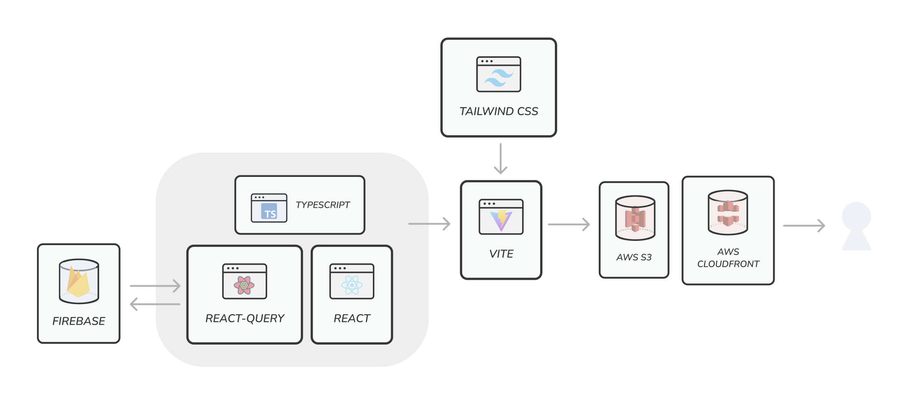<figcaption></figcaption></figure>

- [**기술적 의사 결정**](https://esoby.gitbook.io/cherish/main/tech-decision)

</br>

## 📦 프로젝트 폴더 구조

```
📁 Cherish-Project
├──📁 public
├──📁 cypress                       # E2E 테스트 코드 관리
├──📁 src
│   ├──📁 Assets                    # 프로젝트에 사용되는 파일 관리
│   │   ├──📁 style
│   │   └──📁 images
│   ├──📁 Interfaces                # 프로젝트 내 인터페이스 관리
│   ├──📁 Types                     # 프로젝트 내 타입 관리
│   ├──📁 Components                # 프로젝트 내 컴포넌트 관리
│   │   ├──📁 ui                    # shadcn/ui로 가져온 컴포넌트 저장
│   │   ├──📁 Common                # 여러 페이지에서 사용되는 컴포넌트 저장
│   │   ├──📁 Sign
│   │   ├──📁 Profile
│   │   ├──📁 Product
│   │   ├──📁 Cart
│   │   ├──📁 Order
│   │   ├──📁 Sale
│   ├──📁 Contexts                  # context 파일 관리
│   ├──📁 Hooks                     # hook 함수 파일 관리
│   ├──📁 Pages                     # 라우팅 page 컴포넌트 관리
│   ├──📁 Router                    # react-router 설정 관리
│   ├──📁 Utils                     # 재사용되는 유틸 함수 관리
│   ├──📁 Services                  # API 연동 / 비동기 작업 관련 함수 관리
│   │   ├──📁 firebase              # firebase 작업 관련 함수 관리
│   ├──📄 App.tsx
├──📄 .env
└──📄 README.md
└──🔨 Config
```

</br>

## 📈 기능 소개 및 시연

- 홈 & 상품 상세 보기 / 카테고리별 상품 목록 & 정렬

<div align="center">

<figure><figcaption></figcaption></figure>

<figure>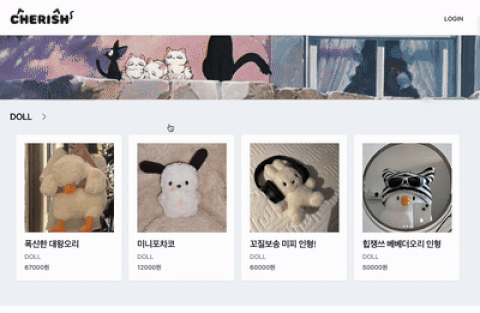<figcaption></figcaption></figure>

</div>

- 회원가입 / 로그인 & 로그아웃

<div align="center">

<figure>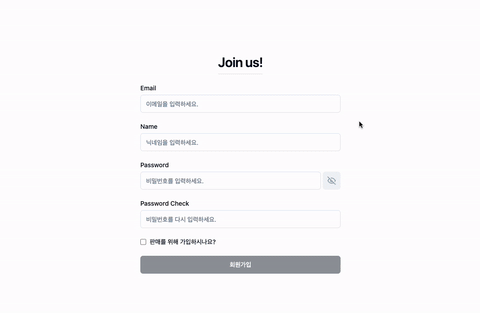<figcaption></figcaption></figure>

<figure>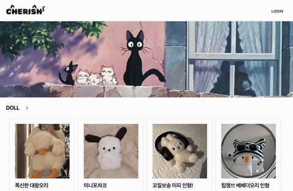<figcaption></figcaption></figure>

</div>

- 개인 정보 수정 - 닉네임 수정 / 비밀번호 수정

<div align="center" data-full-width="false">

<figure>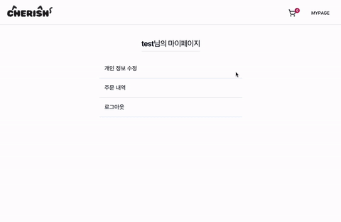<figcaption></figcaption></figure>

<figure>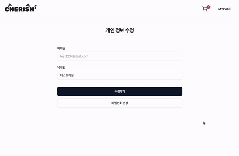<figcaption></figcaption></figure>

</div>

- (일반 계정) 장바구니 추가 / 수량 수정 & 항목 삭제

<div align="center" data-full-width="false">

<figure>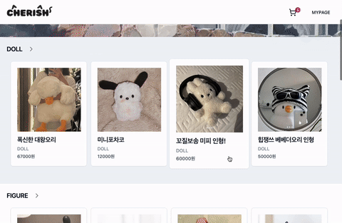<figcaption></figcaption></figure>

<figure>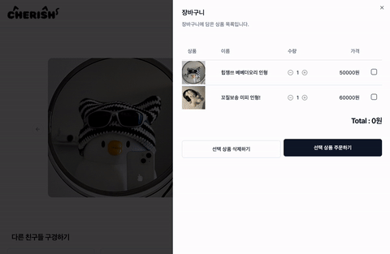<figcaption></figcaption></figure>

</div>

- (일반 계정) 장바구니에서 주문 & 결제 / 상품 페이지에서 바로 주문 & 결제

<div align="center" data-full-width="false">

<figure>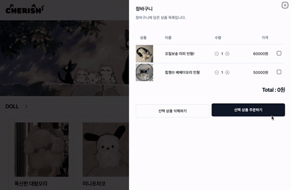<figcaption></figcaption></figure>

<figure>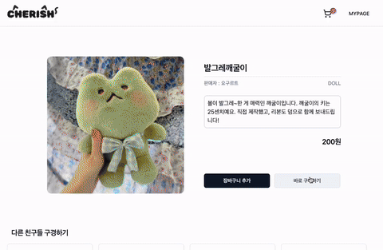<figcaption></figcaption></figure>

</div>

- (일반 계정) 주문 내역 & 주문 상세 내역 & 주문 취소

<div align="center" data-full-width="false">

<figure>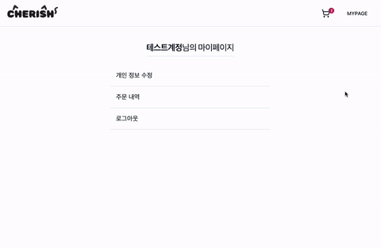<figcaption></figcaption></figure>

</div>

- (판매 계정) 판매 등록 / 수정 & 삭제

<div align="center" data-full-width="false">

<figure>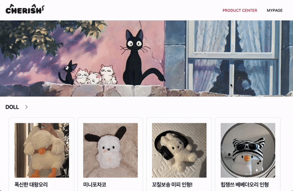<figcaption></figcaption></figure>

<figure>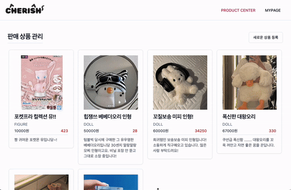<figcaption></figcaption></figure>

</div>

- (판매 계정) 판매 내역 & 판매 상태 변경

<div align="center" data-full-width="true">

<figure>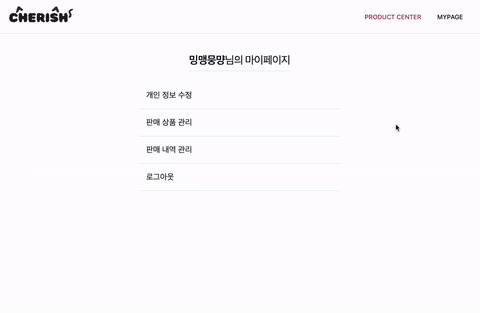<figcaption></figcaption></figure>

</div>

</br>

## ❗️ 트러블 슈팅

- [자세히 보기](https://esoby.gitbook.io/cherish/main/trouble-shooting)

</br>

## ♻️ 리팩토링

- [자세히 보기](https://esoby.gitbook.io/cherish/main/refactoring)

</br>
